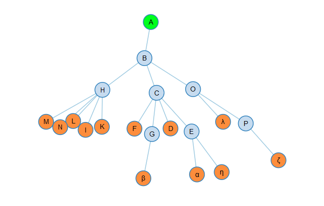
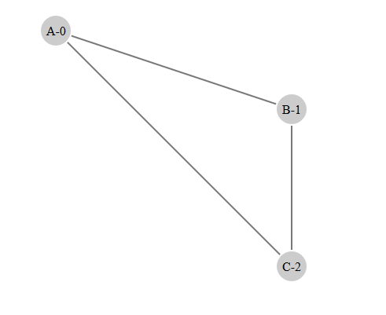
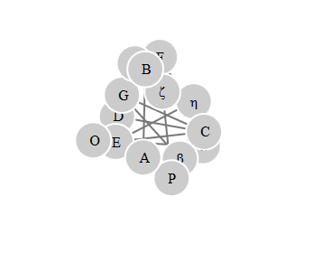
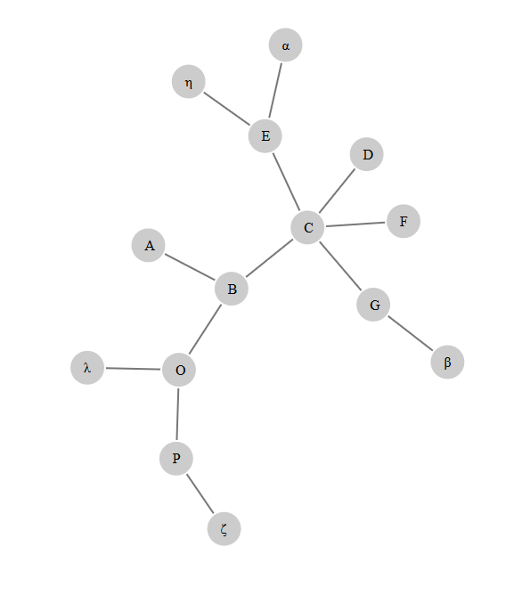
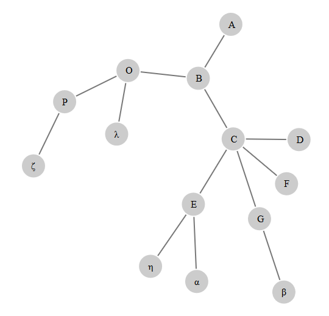
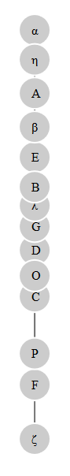
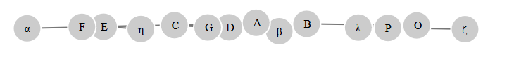
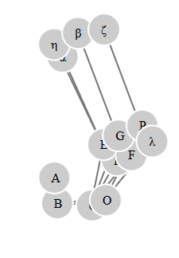
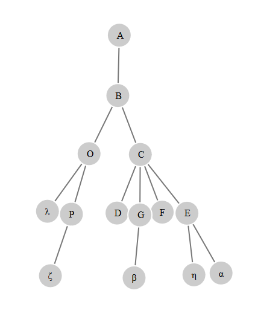

# ForcedTreeDiagramWithD3JS
Build a Tree Diagram with D3js Force Layout v3

## Giới thiệu: 

Trong bài sẽ mô tả từng bước cụ thể để có thể vẽ nên một force layout có dạng cây (Forced-layout Tree Diagram).



## D3JS Force Layout là gì ?

Force layout là một đồ thị vector có hướng linh hoạt sử dụng tích phân để giả lập các định luật vật lý.Vd dụ như thuộc tính pseudo-gravity để giữ các node ở trung tâm của vùng hiển thị, hay fixed-distance để cố định hình học của link,ngoài ra ta còn có thể tạo ra các 'tick' event đặc biệt thông qua các tọa độ x và y của nodes.

Dưới đây là một đối tượng force với các phương thức mặc định nếu các phương thức đó ko được khai báo trong lúc tạo force:   

```javascript
const force = d3.layout.force()
	.nodes(nodes)
	.links(links)
	.size([w,h])
	.linkStrength(0.1)
	.charge(-30)
	.gravity(0.1)
	.theta(0.8)
	.alpha(0.1)
	.start()
```

#### d3.layout.force():  

Khởi tạo một đồ thị hoạt họa vector với các setting mặc đinh: size 1x1, linkStreng 1, friction 0.9, distance 20, độ charge -30, độ gravity 0.1 và biến theta 0.8. Nodes và links mặc định là một mảng rỗng và khi layout bắt đầu, một biến giảm tỏa nội tại được gọi là alpha được tạo với thông số 0.1. Các khởi tạo chung để tạo một đồ thị vector là thiết lập các thuộc tính và sau đó gọi (call) start().  

#### force.size([width,height]):  

Nếu 'size' được khai báo, sẽ thiết lập kích thước của đồ thị với 2 tham số dạng số trong mảng đặc trưng cho x và y. Nếu 'size' không được khai báo,force sẽ lấy giá trị mặc định là [1,1]. 'size' còn ảnh hưởng tới 2 khía cạnh của đồ thị vector là điểm trọng tâm gia tốc (gravittational center) và điểm đặt biến thiên ban đầu (initial random position). Điểm trọng tâm gia tốc đơn giản là điểm (x/2,y/2) trên đồ thị hàm số.  

#### force.linkDistance([distance]):  

Nếu distance được khai báo, nó sẽ thiết lập khoảng cách giữa các nút đã được nối (linked nodes) còn nếu chưa được khai báo, nó sẽ trả về giá trị mặc định là 20.Có thể đưa dạng function vào để đặt linkDistance khác nhau giữa các node và link

Links không hẳn là 'lực co giãn lò xo' (spring forces) như thường được biết tới ở các đồ thị vector khác, mà nó giống các hạn chế hình học yếu. Trong mỗi 'tick' của đồ thị, khoảng cách giữa mỗi nút đã được nối sẽ được tính toán và so sánh với khoảng cách tới đích,links sau đó sẽ di chuyển tới nhau hay đẩy ra xa rồi hội tụ tại điểm đã thiết lập.  

#### force.linkStreng([streng]):  

Thể hiện sự chắc chắn của links thông qua tham số trong khoảng [0,1]. Nếu strength không được khai bạo, đồ thị sẽ trả về giá trị mặc định là 1. Strength có thể không đổi làm cho các link là giống nhau về sự chắc chắn hoặc có thể thay đổi thông qua function.  

#### force.friction([friction]):  

Nếu friction không được khai báo, force sẽ trả về giá trị mặc định là 0.9, nên để giá trị này trong khoảng [0,1 nếu ngoài khoảng này ta sẽ không để lường trước được sự chuyển động của các node và link. Ngoài ra, friction không phải là 'ma sát' mà nó giống 'vận tốc giảm dần' hơn.  

#### force.charge([charge]):  

Nếu charge không được khai báo, force sẽ trả về giá trị mặc định là -30. Giá trị của charge có thể không đổi làm các node sẽ giống nhau về charge hoặc thay đổi theo function.

Khi charge có giá trị '-' ,các node sẽ 'đẩy' nhau còn '+' thì sẽ 'hút' nhau.  

#### force.chargeDistance([distance]):  

Nếu chargeDistance được khai báo, force sẽ thiết lập distance theo tham số, còn nếu không sẽ tả về giá trị mặc định là vô hạn.

#### force.theta([theta]):  

Theta sẽ cài đặt thông số thông qua phép xấp xỉ Barnes-Hut, giá trị mặc định là 0.8.

Để tránh lag do đồ thị lớn, force sẽ sử dụng phép xấp xỉ Barnes-Hut, mất O(n log n) cho mỗi lần tick. Đối với mỗi tick, một quadtree được tạo ra để lưu các vị trí nút hiện tại; Sau đó cho mỗi nút, lực tính tổng của tất cả các nút khác trên nút cho trước được tính. Đối với các nhóm các nút xa hơn, lực thu được xấp xỉ bằng cách xử lý cụm khoảng cách các nút như một nút đơn,hoặc nút lớn. Theta xác định tính chính xác của tính toán: nếu tỷ lệ diện tích của góc phần tư trong quadtree đến khoảng cách giữa một nút đến trung tâm của khối tọa độ thấp hơn theta, tất cả các nút trong góc tọa độ nhất định được coi là một nút đơn, nút lớn, hơn là tính riêng lẻ từng nút.  

#### force.gravity([gravity]):  

Giá trị mặc định của gravity là 0.1

Không nên nhầm lẫn 'gravity' là trọng tâm gia tốc hay trọng lực của 'charge' đã đề cập trên,'gravity' giống như một hạn chế hình học yếu mô phỏng một liên kết kiểu lò xo nối từ node tới trọng tâm của đồ thị. Thế nên nếu node ở gần trọng tâm của đồ thị, gravity sẽ gần như bằng 0, còn ở xa sẽ tăng dần.  

#### force.nodes([nodes]):  

Tham số nodes đưa vào thường dạng mảng các đối tượng node có thuộc tính như sau:  
	* index: vị trí của node trong mảng.  
	* x: tọa độ x của node.  
	* y: tọa độ y của node.  
	* px: tọa độ x vị trí của node ở trước.  
	* py: tọa độ y vị trí của node ở trước.  
	* fixed: định nghĩa xem node có bị cố định hay không, dạng boolean.  
	* weight: weight của node.   

#### force.links([links]):  

Tham số links đưa vào có dạng mảng các link giữa các node, có thuộc tính như sau:  
	* source: node nguồn.  
	* target: node đích.    

#### force.start():

Phương thức để bắt đầu mô phỏng hình họa, phương thức này phải được gọi tới khi layout vừa được khởi tạo và sau khi đã gán nodes và links. Và nó phải được gọi lại nếu nodes hoặc links thay đổi (trong bài sẽ là function update()). Về mặt bản chất, layout sử dụng biến giảm tỏa nội tại alpha để kiểm soát động năng bên trong của layout: khi mô phỏng vật lý đạt mức ổn định, động năng bên trong giảm dần dẫn tới các node sẽ di chuyển chậm lại. Thực ra khi alpha giảm tới một ngưỡng thì mô phỏng sẽ dừng ngay lập tức (trong bài sẽ thấy cây 'lúc lắc' một lúc rồi ngừng hẳn) để giải phóng CPU và tránh tiêu thụ năng lượng. Layout có thể tái động năng bằng cách restart hay resume, ngoài ra nó sẽ tự động khi dùng force.drag.

#### force.on(type,listener):

Gán 'listener' cho event được gọi tới dạng 'type' như 'start','end' và 'tick',trong bài ta sẽ dùng 'tick'.

Đối tượng event (event object) được đưa vào các hàm 'listener' là các object sử dụng d3.dispatch() process. Mỗi event object có 2 thuộc tính: type và alpha. Trong đó type dạng string là 'start','tick' hay 'end' còn alpha là biến giảm tỏa nội tại,trong bài đây là biến quan trọng để tạo nên dạng cây cho layout.

```javascript
//vd về một object event với alpha giảm dần từ 0.9 -> 0.005
Object { type: "tick", alpha: 0.005422585810406335 } 
```

#### force.drag():

Gán cho các node một hành vi dạng kéo-thả (drag and drop), sử dụng mouseover hay touch, drag event còn thiết lập thuộc tính fixed cho chuột mỗi khi ta trỏ (mouseover) vào một đối tượng đã gọi tới drag (trong bài là khi node đang 'lúc lắc', ta trỏ vào sẽ làm node đứng yên), drag event còn giúp ta tái động năng bên trong cho layout thi kéo và thả một node, sử dụng bằng cách gọi:  

```javascript
	node.call(force.drag)  
```
Vì mouseover và mouseup sử dụng ở window hiện tại, vì thế khi ta drag một node, ta vẫn có thể drag tiếp dù node đó đã vượt qua ngoài window rồi (trong bài là khi ta kéo một node ra ngoài biên độ x,y của svg).  

Mỗi event listener sẽ sử dụng một 'force' namespace, nên muốn tránh xung đột với các event listener khác, ta sẽ phải bind tới node hay window. Khi một node bị keo, click event sẽ bắt đầu khi ta mouseup và hành vi mặc định sẽ bị chặn. Thế nên muốn sử dụng click event, ta cần bỏ qua click on drag bằng cách dùng defaultPrevent như sau: 


```javascript  
selection.on("click", function(d) {  
	if (d3.event.defaultPrevented) return; // ignore drag  
	otherwiseDoAwesomeThing();
});  
```

## Phần I: Tạo một Force Layout với các nodes và links cơ bản.

Phần nãy sẽ hướng dẫn tạo một svg chứa các nodes và links nối các node. Source code ở trong phần d3 tutorial, file SimpleExample1.js




#### Bước 1: Khởi tạo data dạng json

data là một đối tượng có dạng json, trong đó có 2 thuộc tính chính là nodes và links, sau này đối với cây tập tin, ta chỉ cần nodes còn link sẽ tạo hàm để tự động nối tới nodes.  

```javascript
    let graph = {
	    "nodes": [
		    { x: 100, y: 100, name: 'A-0', fixed: true }, 
		    { x: 400, y: 200, name: 'B-1', fixed: true }, 
		    { x: 400, y: 400, name: 'C-2', fixed: true }
	    ],

	    "links": [	
		    { source: 0, target: 1 }, // link 1
		    { source: 0, target: 2 }, // link 2
		    { source: 1, target: 2 }  // link 3
	    ]
	}
```

- Về mặt logic,ta sẽ thấy các node có tọa độ x,y, thuộc tính name và fixed cùng với các link nối với các node có index là 0->1 , 0->2 và 1->2.  

- Với hình trên, ta sẽ nối node A với node B thông qua graph.links[0] hay link 1, tương tự, nối nốt A và C thông qua link 2,nốt B và C thông qua link 3

- Khi có nhiều node hơn, ta sẽ có càng nhiều link để nối các nốt với nhau, không nhất thiết phải có 1 link giữa 2 node,thực ra riêng 2 node có thể vẽ 2 link rồi (0->1 và 1->0) nên đối với cây tập tin lớn,ta không cần thiết phải khai báo links trong data mà chỉ cần viết hàm đệ quy trỏ tới nodes rồi gán links mà thôi.

- Thuộc tính 'fixed' như đã nói ở trên sẽ cố định các node và kéo dài link khi ta drag-drop, khi bỏ fixed đi thì link sẽ co giãn về đúng kích thước linkDistance đã khai báo và kéo theo node tới vị trí trọng tâm.

- Thuộc tính name sẽ giúp ta viết thẻ text để gán tên cho node, ngoài ra ta còn có thể cho thêm các thuộc tính như size để vẽ bán kính hay color để vẽ màu etc...
#### Bước 2: Khởi tạo width và height cùng với svg tổng

- Hãy thử xóa thuộc tính fixed để kiểm tra.

```javascript
	//định nghĩa width và heith cho svg
    const width = 640,
    	  height = 480

    	//khởi tạo svg
    let svg = d3.select('body').append('svg')
        .attr('width', width)
        .attr('height', height)
```

#### Bước 3: Khởi tạo Force Layout

* a - Khởi tạo Force Layout và các thuộc tính:

```javascript
    // Thiết lập giá trị nodes và links cho force layout
    let nodes = graph.nodes
    let links = graph.links

    // Khởi tạo force layout
    let force = d3.layout.force()
        .size([width, height]) //đặt giá trị trọng tâm là w/2,h/2
        .nodes(nodes) // gán nodes
        .links(links) // gán links
        .linkDistance(100) // đặt linkDistance
        .on('tick', tick) // gọi tới tick() function
```

* b - Định nghĩa links và nodes cho Force Layout đã tạo trên:

```javascript
    // tạo link với data là mảng links
    let link = svg.selectAll('.link')
        .data(links) //gán data links
        .enter().append('line') //tạo ra thẻ line
        .attr('class', 'link') //gán class

    // tạo node với data là nodes
    let node = svg.selectAll('.node')
    	.data(nodes) //gán data nodes
    
    // tạo nodeEnter vẽ ra thẻ g là thẻ cha
    let nodeEnter = node
    	.enter() //chạy vào thẻ đã gán data
    	.append('g') //tạo ra các thẻ cha là g
        .call(force.drag) 
        //gọi tới force.drag để gán hành vi drag-drop cho thẻ g
	// là thẻ cha của text và circle ở dưới

    // trong thẻ g tạo ra thẻ circle là các hình tròn
    nodeEnter.append('circle')
        .attr('r', 20) //gán bán kính bằng 20
        .attr('class', 'node') //gán class

    // trong thẻ g tạo ra thẻ text để điền name của data
    nodeEnter.append('text') 
        .attr('dx', '-0.75em') //còn có thể bỏ attr này bằng CSS
        .attr('dy', '0.35em') //dx và dy để text ra giữa thẻ circle
        .text(function(d) {
            return d.name //trả về thuộc tính name của data cho text.
        })
```

* c - Khai báo phương thức .start() để vẽ hình:

```javascript
    force.start() //khởi động force layout với phương thức .start()
```

* d - Gán listener tick() cho type 'tick': (bước này ko nhất thiết là bước cuối)

```javascript    
    function tick() {
    	// tick event chạy trong mỗi tick của mô phỏng và event đó sẽ update và hiển thị các nodes và links như code dưới đây
        // 'ontick' sẽ hiển thị layout ngay lập tức, còn 'onend' chỉ hiển thị 
        // sau khi layout đã hết động năng bên trong,làm ảnh hiển thị sau một 
        // thời gian ngắn.
        
        // ta có thể dùng attr transform thay cho cx và cy
        node.attr('transform', function(d) {
                return `translate( ${d.x} , ${d.y} )` //gán tọa độ x,y cho cx,cy
            }) //Vẫn ra kết quả tương tự trên
            // .attr('cx', function(d) { return d.x })
            // .attr('cy', function(d) { return d.y })

        link.attr('x1', function(d) {
                return d.source.x // gán tọa độ x của nguồn cho x1 của link
            })
            .attr('y1', function(d) {
                return d.source.y // gán tọa độ y của nguồn cho y1 của link
            })
            .attr('x2', function(d) {
                return d.target.x // gán tọa độ x của đích cho x2 của link
            })
            .attr('y2', function(d) {
                return d.target.y // gán tọa độ y của đích cho y2 của link
            })
    }
```

## Phần II: Cấu trúc data json của cây tập tin.

Cấu trúc data của cây tập tin có dạng tương tự như phần trên, tuy nhiên một số node sẽ có thêm thuộc tính 'children' thể hiện đó là node cha và 'children' sẽ là một mảng các node con như sau: 

```javascript
{
    "name": "A",
    "root": "true",
    "children": [{
        "name": "B",
        "children": [{
            "name": "C",
            "children": [
                { "name": "D" },
                { "name": "E", "children": [{ "name": "α" }, { "name": "η" }] },
                { "name": "F" },
                { "name": "G", "children": [{ "name": "β" }] }
            ]
        }, {
            "name": "O",
            "children": [
                { "name": "P", "children": [{ "name": "ζ" }] },
                { "name": "λ" }
            ]
        }]
    }]
}
```

Ta sẽ thấy node đầu tiên bao giờ cũng là node 'root' và các node có 'children' dạng mảng các node con. Để 'phẳng' hóa các node và thêm link dựa theo thuộc tính children, ta sẽ viết hàm đệ quy flatten để phẳng hóa nodes và d3.layout.tree([(nodes)]) để có thể thêm link dạng cây tập tin vào node.

#### Phẳng hóa data - flatten nodes: 

```javascript
	function flatten(data) {
	    //khởi tạo một mảng rỗng sẽ là kết quả trả về của function
	    let nodes = [] 
	    let i = 0 // khởi tạo id của node

	    // hàm đệ quy phẳng hóa data
	    function recurse(node) {

	    	//nếu node có thuộc tính 'children' thì gọi hàm đệ quy 
	    	//cho node đó để kiểm tra cho đến khi gặp node leaf (cuối)
	        if (node.children) {
	            node.children.forEach(recurse)
	        }
	        //nếu node ko có id thì thêm id và tăng i sau mỗi lần đệ quy
	        if (!node.id) {
	            node.id = ++i
	        }
	        //đẩy node vào mảng nodes kết quả
	        nodes.push(node)
	    }

	    recurse(data) // đệ quy
	    return nodes // kết quả trả về
	}
```

Kết quả trả về sau khi phẳng hóa data, ta sẽ dùng nodes này để tạo link nối giữa node cha và node con:

```javascript
// mảng nodes bao gồm các object sau:
let nodes = flatten(data) 

nodes = 
	[
		{ name: "D", id: 1 },  
		{ name: "D", id: 1 }, 
		{ name: "α", id: 2 }, 
		{ name: "η", id: 3 }, 
		{ name: "E", children: Array[2], id: 4 },
		{ name: "F", id: 5 }, 
		{ name: "β", id: 6 }, 
		{ name: "G", children: Array[1], id: 7 }, 
		{ name: "C", children: Array[4], id: 8 }, 
		{ name: "ζ", id: 9 }, 
		{ name: "P", children: Array[1], id: 10 }, 
		{ name: "λ", id: 11 }, 
		{ name: "O", children: Array[2], id: 12 }, 
		{ name: "B", children: Array[2], id: 13 }, 
		{ name: "A", root: "true", children: Array[1], id: 14 } 
	]
```

#### D3js Tree Layout:

- Giống như các Layout khác nói chung và Force Layout nói riêng, đối tượng mà  Tree Layout (d3.layout.tree) sẽ trả về có dạng vừa là đối tượng, vừa là function. Thế nên ta có thể gọi tới Tree Layout giống như Force Layout và thêm các phương thức để thay đổi hành vi của nó. Trong phần này ta sẽ tập trung vào d3.layout.tree.link([nodes]) để tạo link cho các nodes.  

- d3.layout.tree.link([nodes]): Đưa vào tham số nodes đã được phẳng hóa và giá trị trả về sẽ là các link nối giữa node cha với node con. Các node 'lá' (leaf node) hay nốt không có con sẽ không có link. Mỗi link là một đối tượng có 2 thuộc tính gồm source và target thể hiện node nguồn và node đích.

- link trả về của nodes vd trên có dạng sau: 

```javascript
let links = d3.layout.tree.links(nodes)

links = 
	[
		//... Object thể hiện 2 node nguồn và đích
		{ source: Object, target: Object }
		//...
	]
```

### Vẽ Cây Tập tin:

Phần này sẽ sử dụng lại file SimpleExample1 đã code ở trên. Ta chỉ cần thay đổi 1 số bước.

#### Thay Đổi Bước 1:

- Viết lại cấu trúc data:

```javascript
let data = {
    "name": "A",
    "root": "true",
    "children": [{
        "name": "B",
        "children": [{
            "name": "C",
            "children": [
                { "name": "D" },
                { "name": "E", "children": [{ "name": "α" }, { "name": "η" }] },
                { "name": "F" },
                { "name": "G", "children": [{ "name": "β" }] }
            ]
        }, {
            "name": "O",
            "children": [
                { "name": "P", "children": [{ "name": "ζ" }] },
                { "name": "λ" }
            ]
        }]
    }]
}
```

- Thay đổi width và height của svg: 

```javascript
    //define width and height of svg 
    const width = 1000,
        height = 750
```


#### Thay đổi Bước 3-a:

- a - Khởi tạo Force Layout và các thuộc tính: Ta sẽ thêm flatten function vào để phẳng hóa data.  

```javascript

    function flatten(data) {
        //khởi tạo một mảng rỗng sẽ là kết quả trả về của function
        let nodes = []
        let i = 0 // khởi tạo id của node

        // hàm đệ quy phẳng hóa data
        function recurse(node) {

            //nếu node có thuộc tính 'children' thì gọi hàm đệ quy 
            //cho node đó để kiểm tra cho đến khi gặp node leaf (cuối)
            if (node.children) {
                node.children.forEach(recurse)
            }
            //nếu node ko có id thì thêm id và tăng i sau mỗi lần đệ quy
            if (!node.id) {
                node.id = ++i
            }
            //đẩy node vào mảng nodes kết quả
            nodes.push(node)
        }

        recurse(data) // đệ quy
        return nodes // kết quả trả về
    }

    // Thiết lập giá trị nodes và links cho force layout
    let nodes = flatten(data)
    let links = d3.layout.tree().links(nodes)

    // Khởi tạo force layout
    let force = d3.layout.force()
        .size([width, height]) //đặt giá trị trọng tâm là w/2,h/2
        .nodes(nodes) // gán nodes
        .links(links) // gán links
        .linkDistance(100) // đặt linkDistance
        .on('tick', tick) // gọi tới tick() function
```

- Vậy là xong, ta sẽ có kết quả sau: 



- Để cho cây dễ nhìn hơn, ta thêm các phương thức sau vào force layout:  

```javascript
let force = d3.layout.force()
	//...
        .linkDistance(100) // đặt chiều dài của link
        .charge(-1000) // đặt độ giãn giữa các node
        .gravity(0.1) //đặt gravity cho node
        //...
```
#### Kết Quả:



- Ưu Điểm: Link đã nối các node con và node cha. Cây tập tin nhìn đỡ rối hơn.

- Nhược Điểm: Theo data thì node A là node root tuy nhiên nhìn vào hình thì nó chẳng khác gì một node leaf, các mối quan hệ giữa các node cũng ko rõ ràng.

## Phần III: Định hình dạng cây có hướng cho Cây tập tin.

#### Mối Quan hệ giữa nodes và links:

Đây là quan hệ 2 chiều, khi ta drag-drop một node như đã code trên thì cả thuộc tính tọa độ (x,y) của cả node và link đều thay đổi, tức là ta thay đổi tọa độ (x,y) của node thì d3js sẽ tự động thay đổi tọa độ (x,y) nguồn hoặc đích so với node của link tương ứng và ngược lại do (x,y) của node,link là một.  

Giả sử có 2 node và 1 link nối 2 node đó, bình thường khi hiển thị trên màn hình thì phương thức gravity sẽ kéo 2 node về giữa thẻ svg, còn hướng của link sẽ tính theo tọa độ vật lý của 2 node,khi kéo và thả đều có thể thay đổi hướng của link. Để có thể hiển thị cây tập tin có hướng, ta có 2 cách, một là đặt tọa độ của node cha luôn trên node con, như vậy sẽ phải tác động tới ít nhất 2 đối tượng node, hai là tác động chỉ tới link, cụ thể là thuộc tính source và target của link do kéo node hay kéo link đều hiển thị như nhau -> ta sẽ tác động tới link trong bài này.

#### Event ontick trong mối quan hệ giữa nodes và links:

```javascript
//vd về một object event với alpha giảm dần từ 0.9 -> 0.005
Object { type: "tick", alpha: 0.005422585810406335 } 
```

'Tick' event sẽ chạy trong mỗi tích tắc của force. Listen tới các tick event sẽ cập nhật liên tục vị trí mới của nodes và links. Ví dụ, nếu ta có các node và link sau:

```javascript
let link = svg.selectAll('line')
                .data(links)
                .enter().append('line')
let node = svg. selectAll('circle')
                .data(nodes)
                .enter().append('circle')
                .attr('r',20)
```

Thì ta có thể thiết lập vị trí của chúng trong ontick event:

```javascript
force.on('tick',function (e) { //e là tick event, d là data
    link.attr('x1', function (d) { return d.source.x })
        .attr('y1', function (d) { return d.source.y })
        .attr('x2', function (d) { return d.target.x })
        .attr('y2', function (d) { return d.target.y })

    // node.attr('cx', function (d) { return d.x })
    //     .attr('cy', function (d) { return d.y })
    // Có thể dùng một trong 2
    node.attr('transform', function (d) {
        return `translate( ${d.x} , ${d.y} )`
    })   
        
})
```

Như vậy, ta đã lưu trữ các node và link vào trong quá trình khởi tạo và vì thế ta cũng không phải reselect các node trong mỗi tích tắc, d3 sẽ tự tính toán cho ta.

#### Tham số alpha của force (e.alpha) và ý nghĩa của nó:

e.alpha chính là tham số giảm tỏa nội tại của tick event, là tham số giảm dần động năng bên trong của layout. e.alpha sẽ giảm dần từ 0.9 về 0.005 trong lúc force.start() và khiến chuyển động của node và link từ từ chậm lại cho đến khi alpha = 0.005 thì dừng hẳn.

k = e.alpha trong tick event thường được gọi là tham số tiêu điểm hay tham số đồng quy (foci). 

Khi ta dùng k để tác động tới thuộc tính (x,y) của node theo một điểm đồng quy cố định thì các nốt được tạo sẽ 'chạy' về điểm đồng quy đó (search multi-foci). Khi ta dùng k để tác động tới thuộc tính source và target của link thì ta sẽ tạo được hướng ngắm tới điểm đồng quy cho link (search depth foci hay parent foci).

Ví dụ khi thêm đoạn này vào trong bước 3-d của event ontick thì ta sẽ tạo được cây tập tin 'yếu' (weak tree). Theo code,đối với cây tập tin, link sẽ đi từ node root tới node branch hoặc node leaf tức là link chạy từ trên xuống và node cha ở trên, node con ở dưới, do cây có chiều thẳng đứng theo tung độ nên ta sẽ nâng tọa độ y của source và giảm tọa độ y của target của link vì thay đổi tọa độ của link thì cũng thay đổi luôn node như đã nói ở trên.

```javascript
// 0------->x
// |
// |
// |
// |
// v y

 function tick(e) {
    link.each(function(d) {
        //tạo ky theo alpha của mỗi node
        let ky =  10 * e.alpha 
        // để tạo hướng lên trên cho node cha, ta sẽ giảm tọa độ y của link
        d.source.y -= ky // thay đổi thuộc tính source theo y
        // để tạo hướng xuống dưới cho node con, ta sẽ tăng tọa độ y của link
        d.target.y += ky //thay đổi thuộc tính target theo y
    })
    .attr(...)
    //... phần còn lại
}
```

- Kết quả ta sẽ được một cây tập tin 'yếu' với node cha sẽ ở trên và nốt con sẽ ở dưới. Source code trong file SimpleExample3.js



#### Dùng tham số đồng quy 'k' để tạo cây tập tin có hướng đúng nghĩa.

- Thực chất ta chỉ cần thay đổi thuộc tính target của link do các node luôn là một node target , tức luôn là một node con, chỉ có duy nhất một node cha là node root (dù là node source thì cũng bị target bới node source khác trừ node root). Thế nên ta sẽ thay đổi thuộc tính target của link làm cho nó luôn hướng xuống.

```javascript
// 
// Hãy kiểm tra chỉ riêng kx hoặc ky để thấy rõ tác dụng của e.alpha
//
function tick(e) {
    link.each(function(d) {
        // tạo kx,ky theo alpha của mỗi node
        let kx = 6 * e.alpha
        let ky = 6 * e.alpha 

        // Ngắm theo chiều x, đẩy tất cả các link đồng quy theo hướng thẳng 
        d.target.x -= (d.source.x - d.target.x) * kx 

        // Ngắm theo chiều y, đẩy tất cả các link đồng quy theo hướng ngang.
        d.target.y += (d.source.y - d.target.y) * ky
    })
    .attr(...)
    //... phần còn lại
}
```

- Kết quả cho ta thấy hướng ngắm đồng quy của kx và ky






- Khi ta để cả kx và ky như trên thì tất cả link sẽ ngắm tới trọng tâm của svg làm cho các node và link vừa đẩy nhau liên tục vừa hội tụ tại trọng tâm gây nên chuyển động loạn nhịp của cây tập tin, tuy nhiên nếu bạn 'bắt' được node root A thì ta sẽ thấy cây tập tin phần nào đã định hình được.



- Cuối cùng, để cây không loạn nhịp, ta sẽ cố định node root bằng cách thêm thuộc tính ' "fixed":"true" ' và tăng khoảng cách d.target.y:

```javascript
function tick(e) {
    link.each(function(d) {
        // tạo kx,ky theo alpha của mỗi node
        // giảm độ ngắm theo chiều thẳng đứng để tránh các link ép vào nhau
        let kx = 0.6 * e.alpha 
        let ky = 6 * e.alpha 

        // Ngắm theo chiều x, đẩy tất cả các link đồng quy theo hướng thẳng 
        d.target.x -= (d.source.x - d.target.x) * kx 

        // Ngắm theo chiều y, đẩy tất cả các link đồng quy theo hướng ngang.
        d.target.y += (d.source.y + 100 - d.target.y) * ky
    })
    .attr(...)
    //... phần còn lại
}
```

- Kết quả cuối cùng, source code tại file SimpleExample4.js

